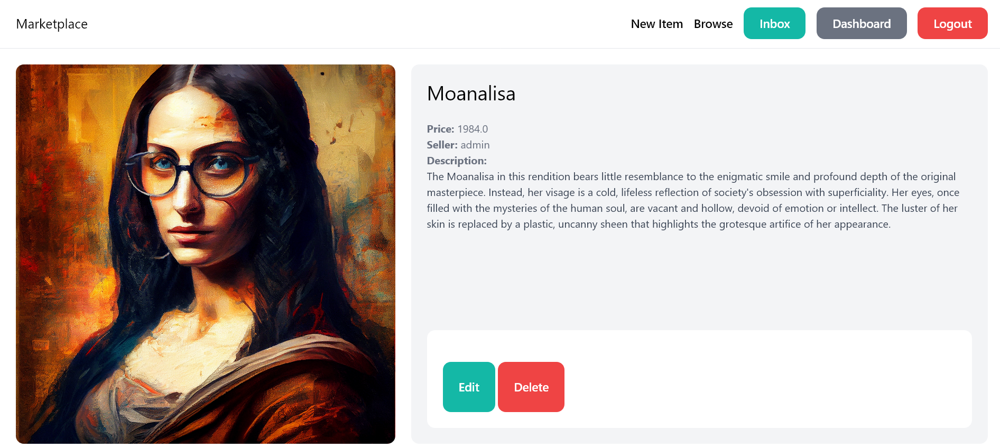
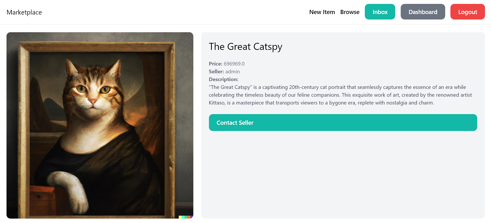

# Marketplace Documentation

**Last Updated:** September 17th, 2023

## Table of Contents

1. [Introduction](#introduction)
2. [Installation](#installation)
3. [Browsing Items](#browsing-items)
4. [Listing Items for Sale](#listing-items-for-sale)
   - [Adding a New Listing](#adding-a-new-listing)
   - [Editing a Listing](#editing-a-listing)
   - [Deleting a Listing](#deleting-a-listing)
5. [Contacting Sellers](#contacting-sellers)
6. [Legality and User Responsibilities](#legality-and-user-responsibilities)

## Introduction<a name="introduction"></a>

The Marketplace platform is your go-to destination for online buying and selling. It simplifies the process of creating listings for items you want to sell, connecting with potential buyers, and managing your online store. Whether you're a seller looking to showcase your products or a buyer searching for unique items, Marketplace has you covered.

### Key Features:

- **User-Friendly Account Management:** Easily create an account and log in to access personalized features and manage your listings.
- **Effortless Item Listings:** Add, edit, and delete your listings with just a few clicks, making it simple to showcase your products.
- **Smooth Communication:** Contact sellers directly through the platform to inquire about listings or negotiate deals.

## Intsallation<a name="installation"></a>

User accounts are at the core of the Marketplace platform. They allow you to access personalized features and manage your listings effectively.

1. Clone the Repository:
   
```bash
git clone https://github.com/Sambonic/marketplace
```

```bash
cd marketplace
```

2. Create a Python Virtual Environment:
```bash
python -m venv env
```

3. Activate the Virtual Environment:
- On Windows:
  ```
  env\Scripts\activate
  ```

- On macOS and Linux:
  ```
  source env/bin/activate
  ```
4. Ensure Pip is Up-to-Date:
  ```
  python.exe -m pip install --upgrade pip
  ```
5. Install Dependencies:

```bash
pip install .
```

6. Run server
```bash
python manage.py runserver
```

7. Copy the IP address and open it in browser which looks something like this:
```bash
http://152.0.0.1:8000/
```

8. Access your admin page by adding "admin" at the end of address
```bash
http://152.0.0.1:8000/admin
```

10. Login with username and password "admin"
    
## Browsing Items<a name="browsing-items"></a>


Marketplace offers an intuitive way to discover items that match your preferences. Whether you're searching for a specific item by name, exploring based on descriptions, or looking within a particular category, the platform has you covered.

## Listing Items for Sale<a name="listing-items-for-sale"></a>



One of the core features of the Marketplace platform is the ability to list items for sale. Whether you're a seller looking to showcase your products or a buyer searching for unique items, this feature allows you to add, edit, and delete listings effortlessly.

### Adding a New Listing<a name="adding-a-new-listing"></a>

To add a new listing:

1. Log in to your Marketplace account.

2. From the navigation bar, click "New Item"

3. Fill out the listing details, including the item's title, description, price, category, and upload images.

4. Click "Submit" to create your listing.

5. Your item is now listed on the Marketplace platform for potential buyers to see.

### Editing a Listing<a name="editing-a-listing"></a>

To edit a listing:

1. Log in to your Marketplace account.

2. Go to your account dashboard.

3. Locate the listing you want to edit.

4. Click on the "Edit" button associated with the listing.

5. Make the desired changes to the listing details.

6. Click "Submit" to apply the changes.

7. Your listing is now updated with the new information.

### Deleting a Listing<a name="deleting-a-listing"></a>

To delete a listing:

1. Log in to your Marketplace account.

2. Access your account dashboard.

3. Find the listing you want to delete.

4. Click on the "Delete" button linked to the listing.

5. Confirm the deletion when prompted.

6. Your listing is now removed from the Marketplace platform.

## Contacting Sellers<a name="contacting-sellers"></a>



Marketplace enables direct communication between buyers and sellers to facilitate inquiries, negotiations, and successful transactions.

To contact a seller:

1. Navigate to the listing you're interested in.

2. Click on the "Contact Seller" button.

3. Compose your message with any questions or requests you have regarding the listing.

4. Click "Submit"

5. The seller will receive your message and respond accordingly.

## Legality and User Responsibilities<a name="legality-and-user-responsibilities"></a>

While Marketplace provides a convenient platform for e-commerce, it's essential to understand and adhere to all applicable laws and regulations related to buying and selling. Users are responsible for:

- Complying with local and international laws regarding e-commerce and online transactions.
- Ensuring the legality of the items they list for sale.
- Honoring commitments made to other users, including timely shipping and accurate item descriptions.

Please review the platform's [Terms of Service and Privacy Policy](LICENSE.md) for more information on user responsibilities and the platform's policies.

The Marketplace platform is designed to promote a safe and enjoyable online buying and selling experience for all users.

For additional information or assistance, please refer to the platform's Help Center or contact our support team.

Thank you for choosing Marketplace, and happy buying and selling!
